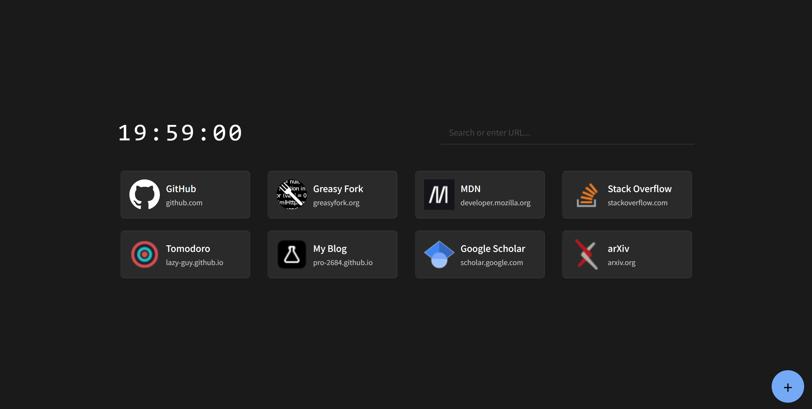
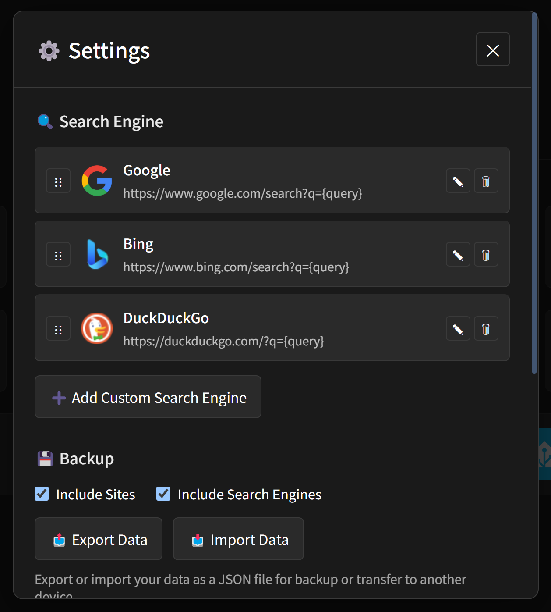

# nano-start

A minimal yet hackable browser start page.

📸 Screenshots

  
  
  
  

## Features

- 🚀 **Vanilla JavaScript**: Pure JavaScript, HTML & CSS without bundlers or frameworks
- 📌 **Pin & Reorder**: Add your favorite websites and reorder them with drag & drop
- 💾 **localStorage**: All preferences are saved locally in your browser
- 👷 **Service Worker**: Caches assets and icons for faster load times and offline access
- 🎨 **Adaptive Theme**: Automatic light/dark theme and transitions using cutting-edge CSS features
- 📱 **Offline First**: Service worker enables offline-first access
- ⚡ **Fast & Lightweight**: Minimal dependencies, minimal footprint

## Usage

### Quick Start

1. Visit [Nano Start](https://nano-start.pages.dev/) in your browser
2. Set it as your browser's start page
3. You can also use extensions like [New Tab Redirect](https://chromewebstore.google.com/detail/new-tab-redirect/icpgjfneehieebagbmdbhnlpiopdcmna) to set it as your browser's new tab page

### Pinned Websites

#### Adding Sites

1. Click the **+** button
2. Edit the website name, URL and icon
    - Click on the icon to edit; You can provide text, emoji or urls
3. Click the **✓** button or press `Enter`

You can also drag and drop links from other websites to the start page to pin them. The website name will be inferred from the link text and title, falling back to the URL if necessary.

#### Editing Sites

1. Hover over the site card and press the **✎** button
2. Edit the website name, URL and icon
    - Click on the icon to edit; You can provide text, emoji or urls
3. Click the **✓** button or press `Enter`

#### Deleting Sites

1. Hover over the site card and press the **🗑** button
2. Press the **🗑** button again to confirm, or press `Esc` if you regretted

#### Ordering Sites

1. Hover over the site card and hold the **⋮⋮** button
2. Drag around and drop on your preferred location
3. The dragged site will be moved before the destination card

### Search Bar

- The search bar will be focused by default on page load
- You can type words to search pinned websites, or search Google using your query
- To navigate through the list, you can use `↑`, `↓`, `Home`, `End`
- To activate an item, you can click it, or press `Enter` if its highlighted
- You can press `Esc` to clear the input and quit search

### Settings

When hovering over the add button **+**, a gear icon **⚙️** will appear. Click it to open the settings dialog. You can also open it by pressing `Ctrl + ,`.

### Advanced Customization

TBD

## Browser Compatibility

Works on most modern browsers. Backwards compatibility is not guaranteed.

## License

AGPL-3.0. See [LICENSE](./LICENSE) file for details.
